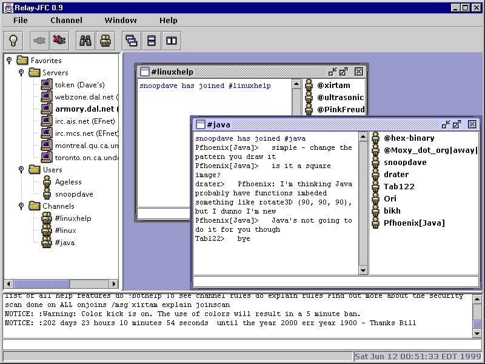

# Relay-IRC

*Copyright 1999-2023 by David M. Johnson*

### TABLE OF CONTENTS
* 1.0 INTRODUCTION
* 2.0 RELAY-JFC FEATURES
* 3.0 RELAY-JFC REQUIREMENTS
* 4.0 INSTALLING & RUNNING RELAY-JFC
* 5.0 BUILDING RELAY-JFC

Here's Relay-JFC in action:

## 1.0 INTRODUCTION
Relay-JFC is an Open Source IRC chat program with an easy-to-use graphical user
interface. 
Relay-JFC is written in Java, so it will run on just about any 
computer.

Relay-JFC is currently available under the terms of the Mozilla public license (see the file 
LICENSE or the Mozilla web site for more on this license).

There is an article about Relay-JFC in Dr. Dobb's, February 1999 issue: [Comparing WFC and JFC](https://www.drdobbs.com/jvm/comparing-wfc-and-jfc/184410855)

# 2.0 RELAY-JFC FEATURES
The significant features of Relay-JFC are:
   * GUI with multiple window interface
   * Support for most IRC commands and replies
   * Color-coded message display
   * Persistent user settings
   * Tree-view of favorite servers and channels
   * Console window for server messages
   * Support for client scripting with Python
   * Support for client programming with Java 
   * IRC class library or "Chat Engine" for Java programmers

There are also some significant limitations:
   * Currently cannot be used as an applet
   * Does not support DCC file transfer

# 3.0 RELAY-JFC REQUIREMENTS
Before you install and run Relay-JFC you need to install a Java. 
At this time, Relay-JFC should run on versions of Java as old as 1.2 and as new as 19.

# 4.0 INSTALLING & RUNNING RELAY-JFC 

There are two types of Relay-JFC downloads: releases and snapshots. A release 
is intended for normal users and a snapshot is intended for developers. 

   ***
   HOW TO DOWNLOAD, INSTALL AND RUN A RELAY-JFC RELEASE
   ***

TBD: released are not yet available here on Github.
   
## 5.0 BUILDING RELAY-JFC
   
If you downloaded the source code to Relay-JFC, then you can build Relay-JFC 
yourself. 
All you need is a Java Development Kit, JDK 1.2 or later (the Ant jar is included with the source).

   Building Relay-JFC:

      Windows: run the relay.bat batch file

         Open a Command Prompt window, cd to the Relay directory and then 
         type 'build' to build Relay-JFC. 
          
      UNIX: run the relay.sh shell script

         Open an X Windows shell window, cd to the Relay directory and then 
         type 'build.sh' build Relay-JFC.

   Build targets: 

      The build scripts support the following targets:

      build          - Builds a runnable Relay-JFC in the dist directory
      build release  - Builds a full set of Relay-JFC release zip and tar files
      build javadocs - Builds javadocs in dist/javadocs
      build clean    - Removes all build and dist directories 

